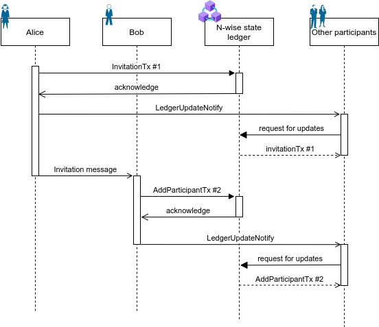

# Aries RFC 0000: Group DID Exchange Protocol 1.0
-   Authors: [Mikhail Lytaev](mikelytaev@gmail.com)
-   Status: [PROPOSED](https://github.com/hyperledger/aries-rfcs/blob/main/README.md#proposed)
-   Since: 2022-07-15
-   Status Note: 
-   Supersedes:
-   Start Date: 2022-07-15
-   Tags: [feature](https://github.com/hyperledger/aries-rfcs/blob/main/tags.md#feature), [protocol](https://github.com/hyperledger/aries-rfcs/blob/main/tags.md#protocol)
## Summary
Настоящий RFC определяет протокол создания и управления отношениями внутри группы [агентов](https://github.com/hyperledger/aries-rfcs/tree/main/concepts/0004-agents) (n-wise). В определенном смысле является обобщением понятия pairwise и протоколов [0160](https://github.com/hyperledger/aries-rfcs/tree/main/features/0160-connection-protocol) и [0023](https://github.com/hyperledger/aries-rfcs/tree/main/features/0023-did-exchange) на произвольное число агентов.

## Motivation

Субъекты SSI и представляющие их агенты должны иметь способ установки взаимоотношений друг с другом. В простейшем случае, когда участвуют два агента, эта цель достигается при помощи протокола [RFC 0023 DID Exchange](https://github.com/hyperledger/aries-rfcs/blob/main/features/0023-did-exchange/README.md) путем создания и защищенного обмена своих DID Documents непосредственно между агентами. Однако часто возникает необходимость организовать взаимодействие, в котором участвуют более двух агентов. При этом число участников может меняться с течением времени, а большая часть агентов может быть мобильными. Наиболее простой и часто используемый пример такого взаимодействия - групповые чаты в instant messenger. Доверенная природа технологии SSI позволяет использовать n-wise для проведения юридически значимых собраний, например собраний собственников жилья или заседаний диссертационных советов.

## Tutorial

### Реестр состояний n-wise

Текущее состояние n-wise представляет собой актуальный список DID Documents участников. В случае с pairwise состояние хранится у участников и обновляются при необходимости непосредственным оповещением другой стороны. Когда участников больше 2 - возникает проблема синхронизации состояния этого n-wise - т.е. [консенсуса](https://en.wikipedia.org/wiki/Consensus_(computer_science)). При этом нужно учитывать, что состояние может периодически меняться: пользователи могут добавляться или удаляться, могут изменяться их DID Document (при ротации ключей или изменении Endpoint).

В принципе, в качестве реестра состояний может выступать любое доверенное хранилище. Можно выделить следующие варианты хранения состояния участников:

- #### Непосредственно у участников
Этот подход наиболее близок к [RFC 0023 DID Exchange](https://github.com/hyperledger/aries-rfcs/blob/main/features/0023-did-exchange/README.md), однако т.к. участников больше 2х - требуется процедура консенсуса для корректного учета изменений в состоянии n-wise. Данный вариант подходит, если участники - облачные агенты, которые (почти) всегда онлайн. В этом случае между ними можно установить консенсус известными алгоритмами (RAFT, Paxos, BFT). Однако если большинство агентов мобильные и находятся в сети лишь эпизодически, известные алгоритмы консенсуса перестают работать. Так что для хранения и обновления состояний нужно некоторое внешнее хранилище. 

- #### Публичный или приватный распределенный реестр (DLT)
В этом случае задачу записи и хранения состояния берет на себя стороння распределенная сеть. Сеть может проверять приходящие в нее транзакции путем исполнения смарт контракта, либо принимать все входящие транзакции (в этом случае валидация транзакций происходит на стороне агентов-участников).

- #### Централизованное хранилище
Если требования безопасности позволяют участникам доверять централизованному решению, то хранение транзакций можно осуществлять централизованно.

Концепция pluggable consensus подразумевает выбор наиболее подходящего способа обслуживания распределенного реестра состояний в зависимости от потребностей.

Изменения состояния n-wise осуществляется путем записи соответствующей транзакции в реестр состояний.
Для получения актуального состояния n-wise агент получает список транзакций из реестра состояний, верифицирует их и применяет по очереди согласно установленным ниже правилам, начиная с `genesisTx`. Некорректные транзакции (без надлежащей подписи или не содержащие необходимых полей) игнорируются. Таким образом, n-wise представляет собой Replicated State Machine, которая исполняется на стороне каждого пользователя.

Особенности записи и получения транзакций зависят от выбранного способа ведения реестра состояний и от конкретного DLT. Данный RFC НЕ ОПРЕДЕЛЯЕТ конкретные реализации реестра состояний.

### Роли
* ##### Пользователь
Субъект, принимающий участие в n-wise. Имеет право:
* вносить изменения в свой DID Document
* удалять себя из n-wise
* создавать приглашения для новых пользователей

* ##### Owner
Автор `genesisTx`. В дополнение к правам пользователя, имеет право
* удалять пользователей
* вносить изменения в метаинформацию n-wise
* передавать свою роль другому пользователю

Одновременно в n-wise может быть только один owner.

* ##### Inviter
Участник, который инициирует приглашение нового агента.
* ##### Invitee
Агент, принимающий приглашение и подключающийся к n-wise. В случае успеха он становится участником n-wise.

### Создание n-wise
Создание начинается с инициализации реестра состояний. Данный RFC НЕ УСТАНАВЛИВАЕТ порядок создания реестра состояний. После создания реестра состояний, создатель n-wise записывает в него транзакцию `genesisTx`. Создатель автоматически считается owner n-wise. Создатель ДОЛЖЕН сгенерировать новый уникальный DID и DID Document для n-wise.

### Приглашение участника
Любой участник может создать приглашение на присоединение к n-wise. Сначала Inviter генерирует пару публичного и приватного ключа приглашения согласно Ed25519. Публичный ключ приглашения записывается в реестр состояния при помощи транзакции типа `invitationTx`.
Пара ключей приглашения является уникальной для каждого Invitee и может быть использована только один раз.
Затем приватный ключ приглашения высылается Invitee по независимому каналу в виде сообщения `Invitation`.

### Принятие приглашения
Получив `Invitation`, Invitee генерирует новый уникальный DID и DID Document для данного n-wise и добавляет транзакцию `AddParticipantTx` в реестр.
НЕ ДОПУСКАЕТСЯ переиспользование DID из других отношений. 

Процесс добавления нового участника показан на рисунке ниже



### Обновление DID Document
Пользователь (и только он) может обновить свой DID Document, например с целью ротации ключей или при обновлении Endpoint.
Обновить DID Document может только сам пользователь. Для этого пользователь записывает транзакцию `updateParticipantTx` в реестр состояния.

### Удаление пользователя
Удаление осуществляется при помощи транзакции `removeParticipantTx`.
Пользователь может удалить сам себя (в этом случае соответствующая транзакция подписывается публичным ключом пользователя). Пользователя так же может удалить owner (в этом случае соответствующая транзакция подписывается публичным ключом owner).

### Обновление метаинформации о n-wise
Метаинформация может быть обновлена owner при помощи транзакции `updateMetadataTx`.

### Передача роли owner другому пользователю
Owner может передать управление n-wise другому участнику n-wise. При этом старый owner теряет соответствующие привилегии и становится обычным участником. Операция выполняется при помощи транзакции NewOwnerTx. 

### Нотификация об изменении в реестре состояний
Сразу после добавления очередной транзакции в реестр состояний, участник ДОЛЖЕН отправить всем остальным участникам сообщение `LedgerUpdateNotify`.
Участник, получивший `LedgerUpdateNotify` ДОЛЖЕН получить актуальное состояние из реестра состояний.

### Обмен сообщениями внутри n-wise
Допускается обмен DIDComm сообщениями любого типа внутри n-wise.
Принадлежность полученного сообщения к определенному n-wise определяется по verkey отправителя.

Данный RFC НЕ ОПРЕДЕЛЯЕТ способ обмена сообщениями внутри группы. В простейшем случае это может быть реализовано как отправка сообщения поочередно каждому участнику. В некоторых случаях целесообразно рассмотреть возможность использования централизованного координатора, который бы отвечал за упорядочивание и гарантированную отправку сообщений от отправителя остальным участникам.

## Reference

### Транзакции состояния n-wise
Состояние n-wise меняется при помощи транзакций.

```json
{
  "type": "transaction type",
  ...
  "proof" {
    "type": "JcsEd25519Signature2020",
    "verificationMethod": "did:alice#key1",
    "signatureValue": "..."

  }
}
```
#### Attributes
* `type` обязательный атрибут, указывающий тип транзакции
* `proof` обязательный атрибут, подпись транзакции в формате [JSON-LD Proof](https://w3c-ccg.github.io/data-integrity-spec/)
* `verificationMethod` зависит от конкретного типа транзакции и будет определен далее


### GenesisTx

Является обязательной начальной транзакцией, определяющей основные свойства n-wise.

```json
{
  "type": "genesisTx",
  "label": "Council",
  "creatorNickName": "Alice",
  "creatorDid": "did:alice",
  "creatorDidDoc": {
   ..
  },
  "ledgerType": "iota@1.0",
  "metaInfo" {
    ...
  }
}
```
#### Attributes
* `label` обязательный атрибут - название n-wise
* `creatorNickname` обязательный атрибут - ник создателя
* `creatorDid` обязательный атрибут - DID создателя
* `creatorDidDoc` обязательный атрибут - DID Document создателя
* `ledgerType` обязательный атрибут - тип используемого реестра состояний
* `metaInfo` необязательный атрибут - дополнительная метаинформация об n-wise, формат которой определяется конкретной реализацией реестра состояний

Транзакция `genesisTx` ДОЛЖНА быть подписана ключом создателя, определенным в его DID Document.


### InvitationTx

Транзакция добавляет в реестр состояний публичные ключи приглашения.

```json
{
  "type": "invitationTx",
  "publicKey": [
    {
      "id": "invitationVerkeyForBob",
      "type": "Ed25519VerificationKey2018",
      "publicKeyBase58": "arekhj893yh3489qh"
    }
  ]
}
```
#### Attributes
* `publicKey` обязательный атрибут - массив публичных ключей приглашения
* `id` обязательный атрибут - идентификатор публичного ключа приглашения
* `type` обязательный атрибут - тип публичного ключа приглашения
* `publicKeyBase58` обязательный атрибут - публичный ключ приглашения в формате Base58.

Транзакция `invitationTx` ДОЛЖНА быть подписана публичным ключом owner, определенном в его DID Document.
 
 
### Invitation message

Сообщение предназначено для приглашения нового участника. Высылается по произвольному каналу связи (pairwise, qr-код, e-mail и т.д.).
 
```json
{
  "@id": "5678876542345",
  "@type": "https://didcomm.org/n-wise/1.0/invitation",
  "label": "Invitaion to join n-wise",
  "invitationKeyId": "invitationVerkeyForBob",
  "invitationPrivateKeyBase58": "qAue25rghuFRhrue....",
  "ledgerType": "iota@1.0",
  "ledger~attach": [
    {
      "@id": "attachment id",
      "mime-type": "application/json",
      "data": {
        "base64": "<bytes for base64>"
      }
    }  
  ]
}
```
#### Attributes
* `label` необязательное поле, представляющее собой человеко-читаемый текст
* `invitationKeyId` идентификатор ключа приглашения
* `invitationPrivateKeyBase58` приватный ключ приглашения
* `ledgerType` тип используемого реестра состояния n-wise
* `ledger~attach` вложение, содержащие необходимую для подключения к реестру метаинформацию. Определяется в зависимости от выбранного реестра.

### AddParticipantTx

Транзакция предназначена для добавления нового участника в n-wise.

```json
{
  "id": "addParticipantTx",
  "nickname": "Bob",
  "did": "did:bob",
  "didDoc": {
    ...
  }
  
}
```
#### Attributes
* `nickname` обязательное поле - ник пользователя
* `did` обязательное поле - DID пользователя
* `didDoc` обязательное поле - DID Document пользователя

Транзакция `AddParticipantTx` ДОЛЖНА быть подписана приватным ключом `invitationPrivateKeyBase58`, полученным в `Invitation`. После добавления транзакции `AddParticipantTx` пара ключей приглашения, которой указанная транзакция была подписана, считается деактивированной (другие приглашения ей подписаны быть не могут).

Исполнитель транзакции ДОЛЖЕН проверить, что ключ приглашения действительно был ранее добавлен. Исполнение транзакции влечет добавление нового участника.

### UpdateParticipantTx

Транзакция предназначена для обновления информации об участнике.

```json
{
  "type": "updateParticipantTx",
  "did": "did:bob",
  "nickname": "Updated Bob",
  "didDoc" {
    ...
  }
}
```
#### Attributes
* `did` обязательный атрибут - DID пользователя, информация о котором обновляется
* `nickname` необязательный атрибут - новый ник пользователя
* `didDoc` необязательный атрибут - новый DID Document

В случае обновления DID Document или nickname, транзакция `updateParticipantTx` ДОЛЖНА быть подписана публичным ключом обновляемого пользователя, информация о котором обновляется. Указанный публичный ключ ДОЛЖЕН быть определен в предыдущей версии DID Document.

Исполнение транзакции влечет обновление информации об участнике.

### RemoveParticipantTx

Транзакция предназначена для удаления участника из n-wise.

```json
{
  "type": "removeParticipantTx",
  "did": "did:bob"
}
```
#### Attributes
* `did` обязательный атрибут - DID удаляемого пользователя

Исполнение транзакции влечет удаление пользователя и его DID Document из списка участников.

Транзакция ДОЛЖНА быть подписана публичный ключом пользователя, который собирается удалиться из n-wise, либо публичным ключом owner.

### UpdateMetadataTx

Транзакция предназначена для обновления метаинформации о n-wise.

```json
{
	"type": "updateMetadataTx",
	"label": "Updated Council"
	"metaInfo": {
	  ...
	}
}
```

#### Attributes
* `label` необязательный атрибут - новое название n-wise
* `metaInfo` необязательный атрибут - новая метаинформация

Транзакция ДОЛЖНА быть подписана публичным ключом owner.

### NewOwnerTx

Транзакция предназначена для передачи прав owner другому пользователю. Старый owner при этом теряет привилегии owner.

```json
{
	"type": "newOwnerTx",
	"did": "did:bob"
}
```

#### Attributes
* `did` обязательный атрибут - DID нового owner

Транзакция ДОЛЖНА быть подписана публичным ключом owner.

### LedgerUpdateNotify

Сообщение предназначено для оповещения участников об добавлении новой транзакции в реестр состояний.

```json
{
  "@id": "4287428424",
  "@type": "https://didcomm.org/n-wise/1.0/ledgerUpdateNotify"
}
```

## Drawbacks
Необходимость в DLT


## Rationale and alternatives
Публичные DID используют ту или иную блокчейн сеть для хранения своего DID Document. [Peer DID](https://identity.foundation/peer-did-method-spec/) отвергает использование блокчейна для хранения состояния DID, что абсолютно логично для pairwise отношений, т.к. DID Document может храниться у партнера. По мере роста числа участников взаимоотношения, актуализируется задача консенсуса состояния. В определенном смысле n-wise является чем-то средним между peer DID (когда DID Document хранится только у партнера) и публичным DID, когда DID Document должен быть доступен неограниченному кругу лиц. Для этого в данном RFC было формально введено понятие реестра состояний, а его конкретные реализации (консенсус между участниками или сторонний доверенный реестр) остаются на усмотрение создателя n-wise.

Интересной высокоуровневой концепцией построения n-wise протоколов является 
[Gossyp](https://github.com/dhh1128/didcomm.org/tree/gossyp/gossyp). 

## Prior art
Понятие n-wise было предложено в спецификации метода [Peer DID](https://identity.foundation/peer-did-method-spec/), а ранее концептуально обсуждалось в [документе](https://docs.google.com/document/d/1BjYdivGQ9GxIz9CJ2ymNvMA68uHZm8bFOTyCHDmziOU/edit#). Однако строгой формализации данного процесса предложено не было, как и не было отмечено необходимости консенсуса между участниками для обслуживания n-wise.


## Unresolved questions
* Это протокол? или feature? или concept?
* Кто должен отвечать за порядок транзакций?
* Где определять конкретные реализации реестра состояний (отдельные rfc?)
* Напрашивается понятие microledger для реестра состояний
* Нужна ли возможность замены реестра?
* Возможно, иерархию пользователей тоже стоит сделать pluggable?

## Implementations
The following lists the implementations (if any) of this RFC. Please do a pull request to add your implementation. If the implementation is open source, include a link to the repo or to the implementation within the repo. Please be consistent in the "Name" field so that a mechanical processing of the RFCs can generate a list of all RFCs supported by an Aries implementation.

Name / Link | Implementation Notes
--- | ---
[Sirius SDK Java](https://github.com/Sirius-social/sirius-sdk-java/) | [IOTA Ledger](https://www.iota.org/) based implementation 

